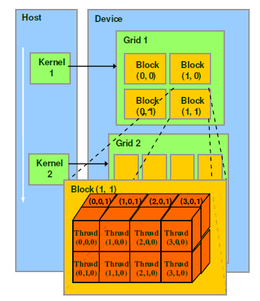

# Hardware
1. SP (Stream Processor, 也叫cuda core) 基础执行单元
2. SM（Streaming MultiProcessor），包含多个SP；
   - SM还包括特殊运算单元(SFU)，共享内存(shared memory)，寄存器文件(Register File)和调度器(Warp Scheduler)

# Software
1. thread: 一个CUDA的并行程序会被以许多个thread来执行。
2. block: 数个thread会被群组成一个block，同一个block中的thread可以同步，也可以通过shared memory进行通信。
3. cluster（optional）: 多个block组成cluster
4. grid: 多个cluster则会再构成grid

# Warp (线程束)
1. SM采用的SIMT(Single-Instruction, Multiple-Thread，单指令多线程)架构，warp(线程束)是最基本的执行单元，一个warp包含32个并行thread，这些thread**以不同数据资源执行相同的指令**。
2. 一个线程块的thread只能在一个SM上调度，SM一般可以调度多个线程块
3. 一个warp中的线程必然在同一个block中，如果block所含线程数目不是warp大小的**整数倍**，那么多出的那些thread所在的warp中，会剩余一些inactive的thread